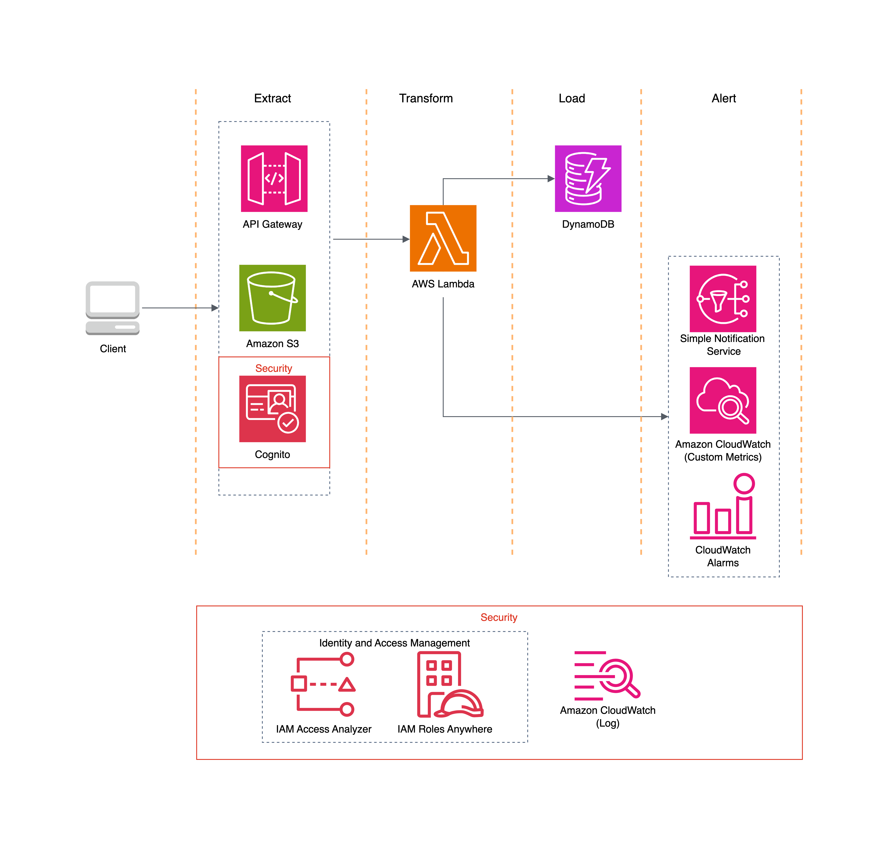

# ETLA Pipeline: Serverless Bus Breakdown Processing

## 1. Architecture Diagram

```
Client ──(POST /bus-event)─> API Gateway ──> Lambda (main.handler)
                                         └──> CloudWatch Logs
                                         └──> CloudWatch Metric: HighPriorityAlerts
                                         └──> S3 (Raw JSON Storage)
                                         └──> DynamoDB (Transformed Data)
                                              └──> Alerts via SNS (if threshold)

Authorization: Cognito JWT Authorizer
CI/CD: GitHub Actions pipeline for testing and deployment
```


---

## 2. Setup Instructions

### Prerequisites:
- AWS CLI configured with IAM credentials
- Terraform installed
   ```bash
   terraform plan -help
   ```

- Zip your lambda handler: `lambda_function_payload.zip`

### Step-by-Step:
```bash
# clone this repo

# change directory
cd nycbus-takehome

# initialize
terraform init

# Review plan
terraform plan

# Apply infrastructure
terraform apply
```

### File Overview:
```
.
├── main.py                        # Lambda function source code
├── lambda_function_payload.zip   # Zipped Lambda for deployment
├── main.tf                       # Terraform infrastructure
├── README.md                     # This documentation
└── .github/workflows/ci.yml      # GitHub Actions CI/CD pipeline
```

### CI/CD Setup:
1. Add AWS credentials to GitHub secrets:
   - `AWS_ACCESS_KEY_ID`
   - `AWS_SECRET_ACCESS_KEY`

2. Push changes to the `main` branch and the CI/CD pipeline will:
   - Lint the Python code
   - Format and validate Terraform
   - Zip and deploy the Lambda function
   - Apply the infrastructure with `terraform apply`

---

## 3. Design Decisions

- **S3 for raw storage:** Immutable, cost-effective storage of payloads for reprocessing or audits.
- **DynamoDB for transformed data:** Serverless, scalable, and allows fast lookups by `Route Number` + `Occurred On`.
- **Lambda over ECS or containers:** Lightweight transformation needs, pay-per-execution simplicity.
- **CloudWatch custom metric (HighPriorityAlerts):** Provides visibility into critical operational events.
- **Cognito Auth:** Avoids managing user auth infrastructure manually.

---

## 4. CI/CD Plan (GitHub Actions)

### CI/CD Pipeline Stages:
1. **Linting & Static Analysis**
   - Run `terraform fmt` and `terraform validate`
   - Python: `flake8`, `black`, or `pylint`

2. **Unit Tests (Lambda handler)**
   - Use `pytest` to test transformation logic

3. **Terraform Plan & Apply**
   - Separate stages for `plan` and `apply`
   - Use environment variables and workspaces for `dev`, `prod`

4. **Package Lambda Code**
   ```bash
   zip lambda_function_payload.zip main.py
   ```
   - Upload to S3 or deploy directly with Terraform

### Environments:
- Use `TF_VAR_environment` or workspaces: `terraform workspace new dev`
- Separate backends for state (optional):
  ```hcl
  terraform {
    backend "s3" {
      bucket = "etla-tf-state"
      key    = "dev/terraform.tfstate"
      region = "us-east-1"
    }
  }
  ```

| Area                  | Technology / Concept       | Purpose / Role                                                                 | Tutorial / Documentation Link                                               |
|-----------------------|----------------------------|--------------------------------------------------------------------------------|------------------------------------------------------------------------------|
| **Infrastructure**    | Terraform                  | Provision AWS resources (API, Lambda, S3, DynamoDB, etc.)                     | [Terraform AWS Docs](https://developer.hashicorp.com/terraform/docs/providers/aws) |
| **API Layer**         | Amazon API Gateway (HTTP)  | Accepts POST requests to receive breakdown events                             | [API Gateway Docs](https://docs.aws.amazon.com/apigateway/latest/developerguide/http-api.html) |
| **Auth**              | Amazon Cognito             | JWT-based authentication for secure API access                                | [Cognito User Pools](https://docs.aws.amazon.com/cognito/latest/developerguide/cognito-user-identity-pools.html) |
| **Compute**           | AWS Lambda                 | Runs the ETL transformation logic in Python                                   | [AWS Lambda Docs](https://docs.aws.amazon.com/lambda/latest/dg/welcome.html) |
| **Storage**           | Amazon S3                  | Stores raw JSON payloads for auditing and reprocessing                        | [S3 Docs](https://docs.aws.amazon.com/s3/index.html) |
| **Database**          | Amazon DynamoDB            | Stores structured, transformed data for querying                              | [DynamoDB Docs](https://docs.aws.amazon.com/amazondynamodb/latest/developerguide/Introduction.html) |
| **Monitoring**        | Amazon CloudWatch          | Logs, metrics (HighPriorityAlerts), and alarms                                | [CloudWatch Docs](https://docs.aws.amazon.com/cloudwatch/index.html) |
| **Alerting**          | Amazon SNS                 | Sends notifications on critical events or Lambda errors                       | [SNS Docs](https://docs.aws.amazon.com/sns/latest/dg/welcome.html) |
| **DevOps**            | GitHub Actions             | CI/CD pipeline to lint, zip, test, and deploy infrastructure + Lambda         | [GitHub Actions Docs](https://docs.github.com/en/actions) |
| **Language**          | Python                     | Transformation logic and structured logging                                   | [Python Docs](https://docs.python.org/3/) |
| **Testing**           | Pytest                     | Unit testing for Lambda logic                                                 | [Pytest Docs](https://docs.pytest.org/en/latest/) |
| **Linting**           | Flake8 / Black             | Python code style checks                                                      | [Black](https://black.readthedocs.io/en/stable/) / [Flake8](https://flake8.pycqa.org/) |
